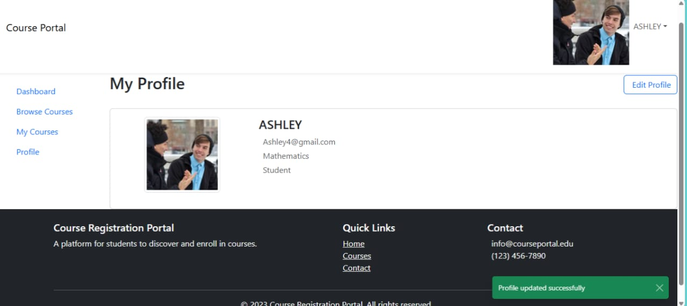

# Digital Course Registration Portal

A full-stack web application for course registration and management, built with React frontend and Spring Boot backend.

## Project Overview

The Digital Course Registration Portal is a comprehensive platform that allows students to browse and register for courses, while providing administrators with tools to manage courses and enrollments. The application features user authentication, role-based access control, and a responsive user interface.

## How to Run the Project

### Prerequisites

- Node.js (v16+) and npm for the frontend
- Java 17 and Maven for the backend
- PostgreSQL database

### Backend Setup

1. Clone the repository
2. Navigate to the backend directory
3. Configure the database connection in `src/main/resources/application.properties`
   ```properties
   spring.datasource.url=jdbc:postgresql://localhost:5432/courseportal
   spring.datasource.username=postgres
   spring.datasource.password=1234
   ```
4. Build and run the Spring Boot application:
   ```bash
   mvn clean install
   mvn spring-boot:run
   ```
   The backend will start on http://localhost:8080

### Frontend Setup

1. Navigate to the frontend directory (`ourse-portal`)
2. Install dependencies:
   ```bash
   npm install
   ```
3. Start the development server:
   ```bash
   npm start
   ```
   The frontend will start on http://localhost:3000

## Key Design Decisions

### Architecture

- **Separation of Concerns**: Clear separation between frontend and backend
- **RESTful API**: Backend exposes RESTful endpoints for frontend consumption
- **JWT Authentication**: Secure authentication using JSON Web Tokens
- **Role-Based Access Control**: Different views and permissions for students and administrators

## API Endpoints

### Authentication

- **POST /api/auth/login**: Authenticate a user and get JWT token
  ```json
  {
    "username": "string",
    "password": "string"
  }
  ```

- **POST /api/auth/register**: Register a new user
  ```json
  {
    "username": "string",
    "password": "string",
    "name": "string",
    "email": "string",
    "department": "string",
    "role": "STUDENT" // or "ADMIN"
  }
  ```

### Courses

- **GET /api/courses**: Get all courses (optional query param: `department`)
- **GET /api/courses/{id}**: Get a specific course by ID
- **POST /api/courses**: Create a new course (Admin only)
  ```json
  {
    "title": "string",
    "code": "string",
    "description": "string",
    "instructor": "string",
    "department": "string",
    "capacity": "number"
  }
  ```
- **PUT /api/courses/{id}**: Update a course (Admin only)

### Enrollments

- **GET /api/enrollments**: Get all enrollments (Admin only)
- **GET /api/enrollments/my-courses**: Get courses enrolled by the current user
- **POST /api/enrollments/enroll/{courseId}**: Enroll in a course
- **DELETE /api/enrollments/drop/{courseId}**: Drop a course

### User

- **GET /api/profile**: Get the current user's profile

### Backend

- **Spring Boot**: Provides a robust framework for building the backend
- **Spring Security**: Handles authentication and authorization
- **Spring Data JPA**: Simplifies database operations
- **PostgreSQL**: Relational database for storing application data
- **JWT**: For stateless authentication between frontend and backend

### Frontend

- **React**: Component-based UI library for building the user interface
- **React Router**: For client-side routing
- **Bootstrap**: For responsive design and UI components
- **Context API**: For state management
- **Fetch API**: For making HTTP requests to the backend

### User Interface Design

- **Responsive Layout**: The application is fully responsive and works on desktop, tablet, and mobile devices
- **Intuitive Navigation**: Clear navigation structure with a consistent navbar and sidebar
- **Card-Based Design**: Course information is presented in easy-to-scan cards
- **Form Validation**: Interactive form validation with clear error messages
- **Toast Notifications**: Non-intrusive notifications for user actions
- **Modal Dialogs**: Clean modal dialogs for login, registration, and form inputs

## Database Schema

The application uses a PostgreSQL database with the following main entities:

### User
```
- id (PK)
- username
- password (encrypted)
- name
- email
- department
- role (STUDENT/ADMIN)
```

### Course
```
- id (PK)
- title
- code
- description
- instructor
- department
- capacity
- enrolled (current enrollment count)
```

### Enrollment
```
- id (PK)
- studentId (FK to User)
- courseId (FK to Course)
- enrollmentDate
```

## Entity Relationships

- A User can enroll in multiple Courses (one-to-many)
- A Course can have multiple enrolled Users (one-to-many)
- The Enrollment table serves as a join table with additional metadata

## Features

### Student Features
- Browse available courses
- Filter courses by department
- Enroll in courses
- View enrolled courses
- Drop courses
- Update profile information

### Admin Features
- View all courses
- Add new courses
- Edit existing courses
- Delete courses
- View all enrollments
- Manage user accounts

## Application Screenshots

> **Note:** To properly display these screenshots in your GitHub repository, please follow these steps:
> 1. Create a `screenshots` directory in your repository root
> 2. Rename your screenshots as indicated below and place them in the `screenshots` directory
> 3. Commit and push the changes to your repository

### Landing Page

*The landing page provides an overview of the application and options to log in or register.*

### Login Page

*Secure login interface for students and administrators.*

### Registration Page

*New users can create an account with their details.*

### Dashboard

*The dashboard provides a quick overview of enrolled courses and available actions.*

### Course Listing

*Browse and filter available courses by department.*

### Course Details

*Detailed view of a course with enrollment options.*

### Admin Panel

*Administrative interface for managing courses and users.*

### Profile Management

*Users can view and update their profile information.*

### Screenshot Mapping Guide

Use this guide to rename your screenshots:

| Original Filename | New Filename for Repository |
|-------------------|----------------------------|
| 1.jpg | landing-page.jpg |
| 2.jpg | login-page.jpg |
| 3.jpg | registration-page.jpg |
| 4.jpg | dashboard.jpg |
| 5.jpg | course-listing.jpg |
| 6.jpg | course-details.jpg |
| 8.jpg | admin-panel.jpg |
| WhatsApp Image 2025-05-18 at 12.04.50_3062d0011.jpg | profile.jpg |

## Challenges Faced

### Backend Challenges

1. **JWT Implementation**: Implementing secure JWT authentication required careful consideration of token generation, validation, and expiration.

2. **Role-Based Authorization**: Ensuring that endpoints are properly secured based on user roles required careful design of security configurations.

3. **Database Relationships**: Designing the proper relationships between entities while maintaining data integrity was challenging.

### Frontend Challenges

1. **State Management**: Managing application state across components required careful design and use of React's Context API.

2. **Authentication Flow**: Implementing a smooth authentication flow with proper error handling and user feedback was complex.

3. **Form Validation**: Implementing comprehensive form validation for registration and course creation forms required attention to detail.

4. **API Integration**: Ensuring proper communication between frontend and backend, especially with JWT authentication, required careful implementation.

## Deployment Options

### Backend Deployment

The Spring Boot backend can be deployed using various methods:

1. **Traditional Server Deployment**:
   - Package the application as a JAR file using `mvn package`
   - Deploy the JAR file to a server with Java installed
   - Run with `java -jar your-application.jar`

2. **Docker Deployment**:
   - Create a Dockerfile in the project root
   - Build a Docker image with `docker build -t course-portal-backend .`
   - Run with `docker run -p 8080:8080 course-portal-backend`

3. **Cloud Deployment**:
   - Deploy to AWS Elastic Beanstalk
   - Deploy to Azure App Service
   - Deploy to Google Cloud Run

### Frontend Deployment

The React frontend can be deployed using:

1. **Static Hosting**:
   - Build the production version with `npm run build`
   - Deploy the contents of the `build` directory to:
     - GitHub Pages
     - Netlify
     - Vercel
     - AWS S3 + CloudFront

2. **Docker Deployment**:
   - Create a Dockerfile using Nginx to serve the static files
   - Build and deploy alongside the backend

## Future Improvements

1. **Enhanced Search**: Implement more advanced search and filtering options for courses.

2. **Notifications**: Add a notification system for important events (enrollment deadlines, course changes).

3. **Mobile App**: Develop a mobile application for better accessibility.

4. **Analytics Dashboard**: Add analytics for administrators to track enrollment trends.

5. **Course Waitlist**: Implement a waitlist feature for courses that reach capacity.

6. **Email Notifications**: Send email confirmations for enrollments and important updates.

7. **Dark Mode**: Implement a dark mode option for the user interface.

## Contributors

- [Arnab]

## License

This project is licensed under the MIT License - see the LICENSE file for details.
